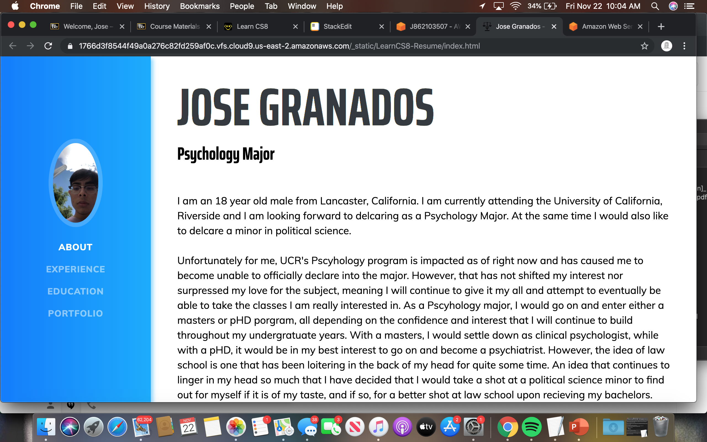

# JOSE GRANADOS

Psychology Major

I am an 18 year old male from Lancaster, California. I am currently attending the University of California, Riverside and I am looking forward to delcaring as a Psychology Major. At the same time I would also like to delcare a minor in political science.  
  
Unfortunately for me, UCR's Pscyhology program is impacted as of right now and has caused me to become unable to officially declare into the major. However, that has not shifted my interest nor surpressed my love for the subject, meaning I will continue to give it my all and attempt to eventually be able to take the classes I am really interested in. As a Pscyhology major, I would go on and enter either a masters or pHD porgram, all depending on the confidence and interest that I will continue to build throughout my undergratuate years. With a masters, I would settle down as clinical psychologist, while with a pHD, it would be in my best interest to go on and become a psychiatrist. However, the idea of law school is one that has been loitering in the back of my head for quite some time. An idea that continues to linger in my head so much that I have decided that I would take a shot at a political science minor to find out for myself if it is of my taste, and if so, for a better shot at law school upon recieving my bachelors.  
  
Aside from my career interests, I am bilingual and ready to communicate with and assist others. Along with my communcation skills, I enjoy working on projects through Adobe Photoshop for fun, such as alternate album covers, wallpapers (included below), or even movie posters. While I have still not mastered the skill of video editing, it is definitely one that I intend to learn to get down, as it would very well coincide with my photo editing skills, and since I simply enjoy multimedia arts.

----------

## EXPERIENCE

### CARPENTING

Assistant

• Assisted my uncle's carpenting business throught the past three summers.  
• Worked from 7 A.M. to 4 P.M. every weekday.  
• Locations varying from Riverside, Beverly Hills, Pasadena, Woodland Hills, and more.  

June 2017 - September 2019

### KEY CLUB

Eastside High School

• Volunteer work at parks, food drives, and clean ups.  
• Over 50+ hours in total  

September 2016 - May 2018

### TUTORING FOR MIDDLE SCHOOL STUDENTS

